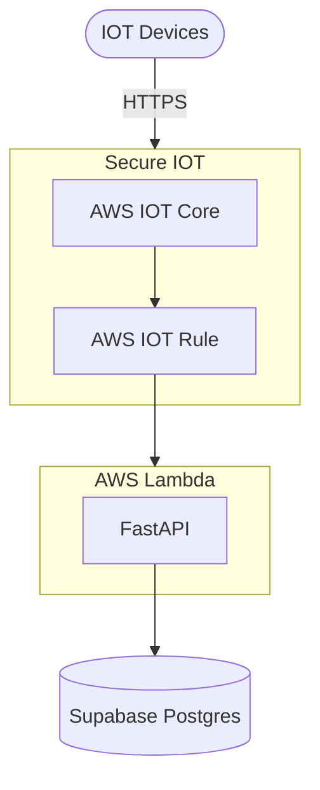

# Transaction Server
Expected Traffic on this service: Maximum rate **50/s**, typical(median) rate **10/day**. Data velocity is super low. Serverless architecture keeps it cheap.

## Architecture

```mermaid
flowchart TB

D([IOT Devices]) --> |HTTPS| A

subgraph A["Secure IOT"]
I[AWS IOT Core]
I --> R[AWS IOT Rule]
end

R --> L

subgraph L["AWS Lambda"]
F[FastAPI]
end

F --> S[(Supabase Postgres)]
```
